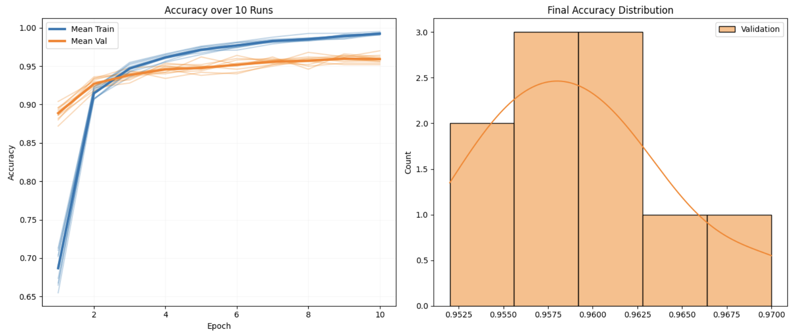

# Ictonyx

**Iteration Comparison Testing Over N-runs: Yield eXamination**

A Python framework for assessing machine learning model variability and performing rigorous statistical comparisons.

[](https://github.com/skizlik/ictonyx/actions/workflows/test.yml)
[](https://pypi.org/project/ictonyx/)


## The Problem

Machine learning models are typically trained once on a given data set. We use a variety of metrics to assess and compare these models - but generally, on one training run.

But training a model involves stochastic factors: random initialization, data shuffling, dropout. Training the same model on the same data will often produce different predicted values and different assessment metrics. Our model parameters aren't constants; they are random variables, and we should treat them that way.

Ictonyx runs your model multiple times and provides complete distributions for your model metrics, along with measures of center and dispersion. This allows inferences to be made about the models we're training.

## Installation

```bash
pip install ictonyx
```

Requires Python 3.10+. Current release: **0.2.0**
([changelog](CHANGELOG.md) · [PyPI](https://pypi.org/project/ictonyx/))

## Quick Start: sklearn

```python
import ictonyx as ix
from sklearn.ensemble import RandomForestClassifier
from sklearn.datasets import load_iris
import pandas as pd

iris = load_iris()
df = pd.DataFrame(iris.data, columns=iris.feature_names)
df['target'] = iris.target

results = ix.variability_study(
    model=RandomForestClassifier,
    data=df,
    target_column='target',
    runs=20
)

print(results.summarize())
```

Output:
```
Study Summary:
  Successful runs: 20/20
  Val accuracy: 0.8800 (SD = 0.0267)
```

## Comparing Two Models

```python
import ictonyx as ix
from sklearn.ensemble import RandomForestClassifier, GradientBoostingClassifier
from sklearn.datasets import load_iris
import pandas as pd

iris = load_iris()
df = pd.DataFrame(iris.data, columns=iris.feature_names)
df['target'] = iris.target

comparison = ix.compare_models(
    models=[RandomForestClassifier, GradientBoostingClassifier],
    data=df,
    target_column='target',
    runs=20
)

print(comparison['overall_test'].get_summary())
```

Output:
```
Kruskal-Wallis: 26.000, p=0.0000 ***, eta-squared=0.658, 95% CI [0.0312, 0.1088]
```

## Intelligent Statistical Analysis

When you compare models, Ictonyx doesn't just run a single test. It builds a complete statistical argument:

1. **Assumption checking** — tests both groups for normality (Shapiro-Wilk) and equal variance (Levene's test)
2. **Automatic test selection** — routes to Student's t-test, Welch's t-test, or Mann-Whitney U based on what the data actually supports
3. **Effect sizes** — reports Cohen's d or rank-biserial correlation so you know if the difference is practically meaningful, not just statistically significant
4. **Bootstrap confidence intervals** — computes BCa (bias-corrected and accelerated) 95% CIs for both the mean difference and the effect size, giving you a plausible range for the true performance gap
5. **Multiple comparison correction** — applies Bonferroni, Holm, or Benjamini-Hochberg when comparing 3+ models

All of this happens automatically inside `compare_models()` and `compare_two_models()`. No configuration needed.

## Deep Learning: MNIST Example with Visualization

The library was originally built for TensorFlow/Keras workflows. This example trains a CNN 10 times and plots the variability:

```python
import numpy as np
import tensorflow as tf
from tensorflow.keras import Sequential, layers, Input

import ictonyx as ix
from ictonyx import (
    ModelConfig,
    KerasModelWrapper,
    ArraysDataHandler,
    run_variability_study,
    plot_variability_summary
)

# Load MNIST
(X_train, y_train), _ = tf.keras.datasets.mnist.load_data()
X_train = X_train.astype('float32') / 255.0
X_train = X_train[..., np.newaxis]

# Use subset for speed
X = X_train[:5000]
y = y_train[:5000]

def create_cnn(config: ModelConfig) -> KerasModelWrapper:
    model = Sequential([
        Input(shape=(28, 28, 1)),
        layers.Conv2D(32, (3, 3), activation='relu'),
        layers.MaxPooling2D((2, 2)),
        layers.Conv2D(64, (3, 3), activation='relu'),
        layers.MaxPooling2D((2, 2)),
        layers.Flatten(),
        layers.Dense(64, activation='relu'),
        layers.Dense(10, activation='softmax')
    ])
    model.compile(
        optimizer='adam',
        loss='sparse_categorical_crossentropy',
        metrics=['accuracy']
    )
    return KerasModelWrapper(model)

config = ModelConfig({'epochs': 10, 'batch_size': 64, 'verbose': 0})
data_handler = ArraysDataHandler(X, y)

results = run_variability_study(
    model_builder=create_cnn,
    data_handler=data_handler,
    model_config=config,
    num_runs=10
)

print(results.summarize())

plot_variability_summary(
    all_runs_metrics_list=results.all_runs_metrics,
    final_metrics_series=results.final_metrics['val_accuracy'],
    metric='accuracy'
)
```

Output:

```
Study Summary:
  Successful runs: 10/10
  val_accuracy: 0.9592 (SD = 0.0050)
  Seed: 42
Variability Study Results
==============================
Successful runs: 10
Seed: 42
val_accuracy:
  Mean: 0.9592
  Std:  0.0050
  Min:  0.9520
  Max:  0.9700
```


## GPU Memory Isolation

Training Keras models in a loop leaks GPU memory. Ictonyx can run each training session in an isolated subprocess:

```python
results = run_variability_study(
    model_builder=create_cnn,
    data_handler=data_handler,
    model_config=config,
    num_runs=10,
    use_process_isolation=True,
    gpu_memory_limit=4096
)
```

## Features

- **Variability studies** — run N training iterations, get full metric distributions with mean, SD, min, max
- **Statistical model comparison** — assumption-driven test selection, effect sizes, bootstrap confidence intervals, multiple comparison correction
- **Framework support** — scikit-learn and TensorFlow/Keras, with model wrappers that handle the training loop
- **GPU memory isolation** — subprocess-based training to prevent memory leaks in repeated Keras runs
- **Visualization** — training curves, metric distributions, forest plots, comparison boxplots
- **High-level API** — `variability_study()` and `compare_models()` for single-function usage

## License

MIT
