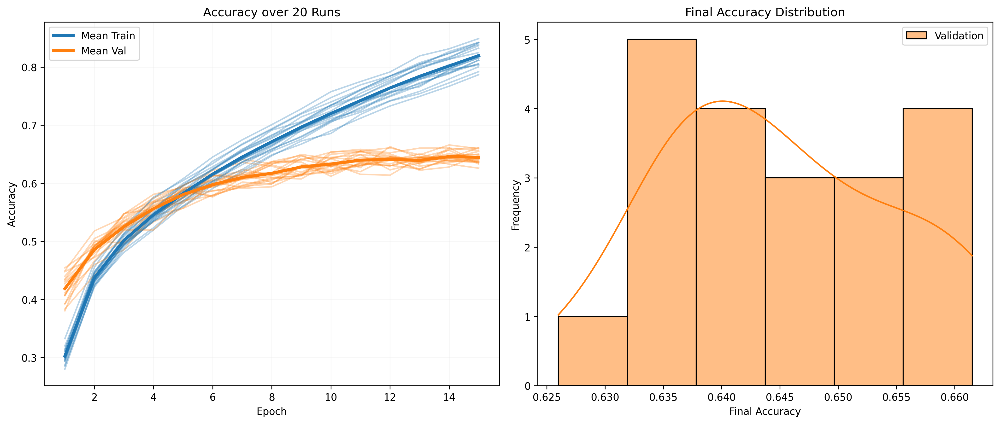
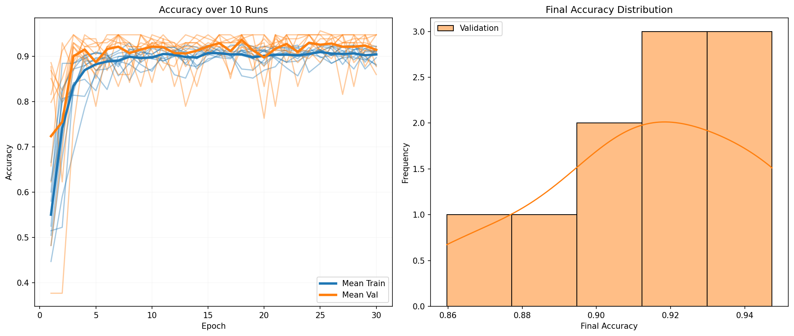

# Ictonyx

**Iteration Comparison Testing Over N-runs: Yield eXamination**

A Python framework for studying machine learning model variability and performing rigorous statistical comparisons.

[](https://github.com/skizlik/ictonyx/actions/workflows/test.yml)
[](https://pypi.org/project/ictonyx/)


[](https://colab.research.google.com/github/skizlik/ictonyx/blob/main/examples/quickstart.ipynb)

---

## The problem

Training a neural network involves stochastic factors: random weight initialisation, data shuffling, dropout. Train the same architecture on the same dataset twice and you will get different weights, different predictions, and different evaluation metrics.

This means a model's performance is a random variable, not a constant — and treating it as a constant, as most practitioners do, leads to conclusions that cannot be replicated or trusted. Reporting a single accuracy from a single training run is not a measurement; it is a sample of size one.

Ictonyx trains a model N times under independent random seeds, collects the full distribution of outcomes, and provides the statistical machinery to reason about that distribution rigorously.

---

## Installation

```bash
pip install ictonyx tensorflow
```

Requires Python 3.10+. Current release: **0.3.10** — [changelog](CHANGELOG.md) · [PyPI](https://pypi.org/project/ictonyx/)

scikit-learn and PyTorch are also supported. See the [examples](examples/) directory.

---

## Quick start

Train a small CNN on CIFAR-10 ten times and observe the distribution of outcomes. The task is genuinely difficult — 10 classes, colour images, a non-convex loss landscape — so initialisation matters and the spread across runs is real.

```python
import numpy as np
import tensorflow as tf
import ictonyx as ix
from ictonyx import ModelConfig, KerasModelWrapper, ArraysDataHandler, run_variability_study

# Load CIFAR-10 — downloads once to ~/.keras/datasets/, cached permanently after
(X_train, y_train), _ = tf.keras.datasets.cifar10.load_data()
X = (X_train[:20000].astype('float32') / 255.0)
y = y_train[:20000].flatten()


def build_cnn(config: ModelConfig) -> KerasModelWrapper:
    model = tf.keras.Sequential([
        tf.keras.Input(shape=(32, 32, 3)),
        tf.keras.layers.Conv2D(32, (3, 3), activation='relu', padding='same'),
        tf.keras.layers.MaxPooling2D((2, 2)),
        tf.keras.layers.Conv2D(64, (3, 3), activation='relu', padding='same'),
        tf.keras.layers.MaxPooling2D((2, 2)),
        tf.keras.layers.Conv2D(64, (3, 3), activation='relu', padding='same'),
        tf.keras.layers.Flatten(),
        tf.keras.layers.Dense(128, activation='relu'),
        tf.keras.layers.Dropout(0.4),
        tf.keras.layers.Dense(10, activation='softmax'),
    ])
    model.compile(
        optimizer='adam',
        loss='sparse_categorical_crossentropy',
        metrics=['accuracy'],
    )
    return KerasModelWrapper(model)


config = ModelConfig({'epochs': 15, 'batch_size': 64, 'verbose': 0})
data_handler = ArraysDataHandler(X, y)

results = run_variability_study(
    model_builder=build_cnn,
    data_handler=data_handler,
    model_config=config,
    num_runs=10,
    seed=42,
)

print(results.summarize())
```

```
Study Summary:
  Successful runs: 10/10
  train_loss: 0.4799 (SD = 0.0479)
  train_accuracy: 0.8267 (SD = 0.0182)
  val_loss: 1.1786 (SD = 0.0356)
  val_accuracy: 0.6553 (SD = 0.0138)
Variability Study Results
==============================
Successful runs: 10
Seed: 42
train_accuracy:
  Mean: 0.8267
  Std:  0.0182
  Min:  0.7962
  Max:  0.8542
train_loss:
  Mean: 0.4799
  Std:  0.0479
  Min:  0.4066
  Max:  0.5564
val_accuracy:
  Mean: 0.6553
  Std:  0.0138
  Min:  0.6275
  Max:  0.6705
val_loss:
  Mean: 1.1786
  Std:  0.0356
  Min:  1.1083
  Max:  1.2164
```

Here we have a 4.3 percent range for validation accuracy — from 62.8% to 67.1% — across ten runs of the same architecture on the same data.  This represents a source of variability that shouldn't be neglected.

```python
ix.plot_variability_summary(
    all_runs_metrics_list=results.all_runs_metrics,
    final_metrics_series=results.final_metrics['val_accuracy'],
    metric='accuracy',
)
```



---

## Comparing two architectures

A common question in deep learning: does adding depth or regularisation actually help, or does it just happen to get a better seed? Ictonyx answers this by running a full variability study for each architecture and applying a statistical test to the resulting distributions.

```python
def build_dense(config: ModelConfig) -> KerasModelWrapper:
    """A simpler dense baseline — no convolutions."""
    model = tf.keras.Sequential([
        tf.keras.Input(shape=(32, 32, 3)),
        tf.keras.layers.Flatten(),
        tf.keras.layers.Dense(256, activation='relu'),
        tf.keras.layers.Dropout(0.4),
        tf.keras.layers.Dense(128, activation='relu'),
        tf.keras.layers.Dense(10, activation='softmax'),
    ])
    model.compile(
        optimizer='adam',
        loss='sparse_categorical_crossentropy',
        metrics=['accuracy'],
    )
    return KerasModelWrapper(model)


comparison = ix.compare_models(
    models=[build_cnn, build_dense],
    data=data_handler,
    runs=10,
    metric='val_accuracy',
    seed=42,
)

print(comparison.get_summary())
```

```
Model Comparison Results (val_accuracy)
========================================
Models compared: 2
Omnibus test: Kruskal-Wallis H-Test: 14.296, p=0.0002 ***, epsilon-squared=0.739

Pairwise comparisons (holm correction):
  build_cnn_vs_build_dense: Mann-Whitney U Test: 100.000, p=0.0002 ***, rank-biserial correlation=1.000 *

Significant pairs: build_cnn_vs_build_dense
```

A rank-biserial correlation of 1.0 means the CNN outperformed the dense network in every single one of the ten paired runs. The p-value establishes that this is not attributable to chance; the effect size establishes that it is absolute.

---

## Process isolation for GPU runs

Keras models accumulate GPU memory across training runs in a loop. For studies with many runs or large models, run each training session in a subprocess:

```python
results = run_variability_study(
    model_builder=build_cnn,
    data_handler=data_handler,
    model_config=config,
    num_runs=10,
    use_process_isolation=True,
    gpu_memory_limit=4096,
    seed=42,
)
```

Each run executes in a child process and exits cleanly, releasing all GPU memory before the next run begins.

---

## scikit-learn

Ictonyx works equally well with sklearn estimators. Pass a class and Ictonyx constructs a fresh instance for each run; pass a configured instance and Ictonyx clones it per run via `sklearn.base.clone()`.

```python
import ictonyx as ix
from sklearn.ensemble import RandomForestClassifier, GradientBoostingClassifier
from sklearn.datasets import load_breast_cancer
import pandas as pd

data = load_breast_cancer()
df = pd.DataFrame(data.data, columns=data.feature_names)
df['target'] = data.target

comparison = ix.compare_models(
    models=[RandomForestClassifier, GradientBoostingClassifier],
    data=df,
    target_column='target',
    runs=20,
    metric='val_accuracy',
    seed=42,
)

print(comparison.get_summary())
```

```
Model Comparison Results (val_accuracy)
========================================
Models compared: 2
Omnibus test: Kruskal-Wallis H-Test: 2.053, p=0.1519 ns, epsilon-squared=0.028

No pairwise comparisons performed (omnibus test not significant).
```


---

## PyTorch

```python
import torch
import torch.nn as nn
import ictonyx as ix
from ictonyx import ModelConfig, PyTorchModelWrapper, ArraysDataHandler, run_variability_study

def build_net(config: ModelConfig) -> PyTorchModelWrapper:
    model = nn.Sequential(
        nn.Linear(30, 64), nn.ReLU(),
        nn.Linear(64, 32), nn.ReLU(),
        nn.Linear(32, 2),
    )
    return PyTorchModelWrapper(
        model,
        criterion=nn.CrossEntropyLoss(),
        optimizer_class=torch.optim.Adam,
        optimizer_params={'lr': config.get('learning_rate', 0.001)},
        task='classification',
    )

# Pass arrays directly — Ictonyx handles splitting
import numpy as np
from sklearn.datasets import load_breast_cancer
data = load_breast_cancer()
X = data.data.astype(np.float32)
y = data.target.astype(np.int64)

results = run_variability_study(
    model_builder=build_net,
    data_handler=ArraysDataHandler(X, y, val_split=0.2, test_split=0.1),
    model_config=ModelConfig({'epochs': 30, 'batch_size': 32, 'learning_rate': 0.001}),
    num_runs=10,
    seed=42,
)

ix.plot_variability_summary(
    all_runs_metrics_list=results.all_runs_metrics,
    final_metrics_series=results.final_metrics['val_accuracy'],
    metric='accuracy',
)
```



---

## Working with results

```python
# Full distribution of any metric across runs
results.get_metric_values('val_accuracy')       # List[float]

# Per-epoch statistics across all runs
results.get_epoch_statistics('val_accuracy')    # DataFrame: epoch, mean, sd, se, ci_lower, ci_upper

# All per-run, per-epoch DataFrames
results.all_runs_metrics                        # List[pd.DataFrame]

# Seed for exact reproducibility
results.seed
```

---

## Examples

The `examples/` directory contains Jupyter notebooks:

- `quickstart.ipynb` — CIFAR-10 variability study and two-architecture comparison
- `01_cifar10_variability_study.ipynb` — deep dive into CNN variability with full visualisation
- `02_cifar10_model_comparison.ipynb` — comparing architectures statistically
- `03_learning_rate_variability.ipynb` — grid study across learning rates and batch sizes
- `04_pytorch_classification.ipynb` — PyTorch classification workflow
- `05_pytorch_regression.ipynb` — PyTorch regression workflow
- `06_sklearn_models.ipynb` — comparing multiple sklearn classifiers

---

## License

MIT. See [LICENSE](LICENSE).

---

## Citation

If you use Ictonyx in published work, please cite it using the metadata in
[`CITATION.cff`](CITATION.cff), or use the **Cite this repository** button
on the GitHub repository page.

```bibtex
@software{kizlik_ictonyx,
  author  = {Kizlik, Stephen},
  title   = {Ictonyx: A Framework for Variability Analysis in Machine Learning Training},
  version = {0.3.10},
  url     = {https://github.com/skizlik/ictonyx},
  license = {MIT},
}
```
