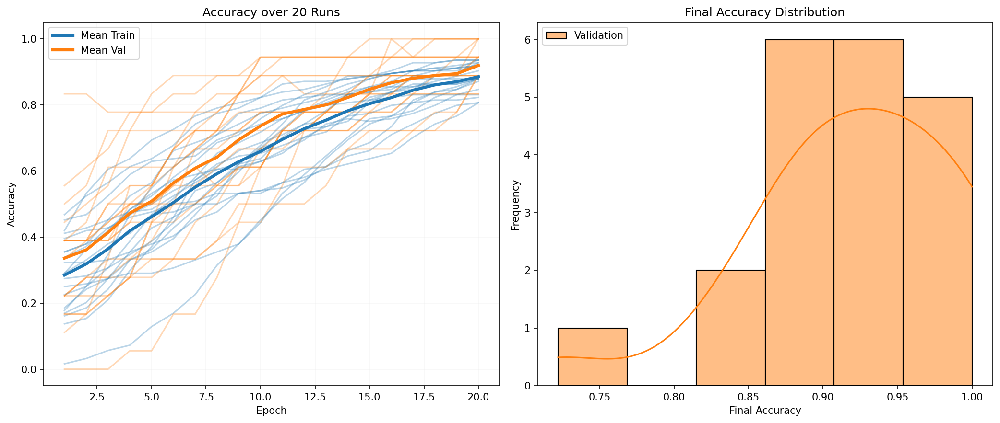
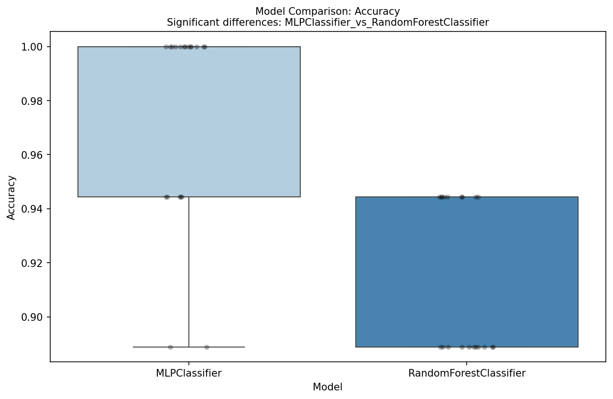

# Ictonyx

A Python framework for evaluating machine learning training variability and performing rigorous statistical comparisons.

[](https://github.com/skizlik/ictonyx/actions/workflows/test.yml)
[](https://pypi.org/project/ictonyx/)


[](https://colab.research.google.com/github/skizlik/ictonyx/blob/main/examples/quickstart.ipynb)

---

## The problem

Training a machine learning model involves stochastic factors: random weight initialisation, data shuffling, dropout. Train the same architecture on the same dataset twice and you will get different weights, different predictions, and different evaluation metrics.

This means a model's performance metrics are random variables, not constants — and treating them as constants, as is often done in practice, undermines the robustness and validity of our conclusions. Reporting accuracy from a single training run is not an adequate assessment; it is a sample of size one.

Ictonyx trains a model N times under independent random seeds, collects the full distribution of outcomes, and provides the statistical machinery to reason about that distribution rigorously.

---

## Installation
```bash
pip install ictonyx
```

### Optional extras

| Extra | What it includes | Install |
|---|---|---|
| `sklearn` | scikit-learn, joblib | `pip install ictonyx[sklearn]` |
| `tensorflow` | TensorFlow, Keras | `pip install ictonyx[tensorflow]` |
| `torch` | PyTorch | `pip install ictonyx[torch]` |
| `huggingface` | Transformers, datasets, accelerate | `pip install ictonyx[huggingface]` |
| `mlflow` | MLflow tracking | `pip install ictonyx[mlflow]` |
| `explain` | SHAP explainability | `pip install ictonyx[explain]` |
| `tuning` | Optuna hyperparameter tuning | `pip install ictonyx[tuning]` |
| `isolation` | Process isolation for GPU runs | `pip install ictonyx[isolation]` |
| `progress` | tqdm progress bars | `pip install ictonyx[progress]` |
| `all` | Everything above | `pip install ictonyx[all]` |

Extras can be combined:
```bash
pip install "ictonyx[tensorflow,isolation]"
```

Requires Python 3.10+. Current release: **0.4.8** — [changelog](CHANGELOG.md) · [PyPI](https://pypi.org/project/ictonyx/)

---

### Documentation

[Ictonyx documentation](https://ictonyx.readthedocs.io/en/latest/) is hosted on Read the Docs.

### Docker environment

A GPU-enabled container with TensorFlow, PyTorch, and the HuggingFace
stack pre-installed. Files created inside the container are owned by
your host user, not root.  Requires Docker.

```bash
./build-gpu.sh           # build the image
./test-gpu.sh            # verify the Docker build
./run-gpu.sh             # launch Jupyter on port 8888
./run-gpu.sh bash        # interactive shell
```

The NVIDIA Container Toolkit is required for GPU acceleration.
CPU-only for macOS and non-NVIDIA systems.

---


## What does Ictonyx measure?

Ictonyx characterizes **training-derived randomness** under a fixed data split. Metrics are assessed across different seeds — isolating the random effects in initialization, batch order, augmentation, and dropout — while holding the train/val/test split constant. Repeated runs of the same model on the same data allow for a variety of plotting and analysis functions.

Ictonyx does **not** currently measure **sampling variability** — which is caused by the random nature of a train-validation-test split. Different splits produce different results.  At present, this can be addressed by using Ictonyx within an outer k-fold loop. In a later release, Ictonyx will ship ResamplingPolicy for nested (data × seed) designs with corrected comparison tests (Nadeau-Bengio, Bouckaert, Dietterich 5×2).

---

## Quick start

Train a small feed-forward network on the wine data from sklearn twenty times and observe the distribution of outcomes.  Here, we'll use a simple Tensorflow model.

```python
import tensorflow as tf
from sklearn.datasets import load_wine
from sklearn.preprocessing import StandardScaler
import ictonyx as ix

data = load_wine()
X = StandardScaler().fit_transform(data.data)
y = data.target


def build_model(config):
    model = tf.keras.Sequential([
        tf.keras.layers.Dense(16, activation='relu'),
        tf.keras.layers.Dense(16, activation='relu'),
        tf.keras.layers.Dense(3, activation='softmax')
    ])
    model.compile(optimizer='adam',
                  loss='sparse_categorical_crossentropy',
                  metrics=['accuracy'])
    return ix.KerasModelWrapper(model)

results = ix.variability_study(
    model=build_model,
    data=(X, y),
    runs=20,
    epochs=20,
    seed=42,
    verbose=False
)

print(results.summarize())
```

```
Variability Study Results
==============================
Successful runs: 20
Seed: 42

Test Set Metrics:
--------------------
accuracy:
  Mean:             0.9097
  SD (sample, N-1): 0.0467
  Min:              0.8333
  Max:              0.9722
loss:
  Mean:             0.5285
  SD (sample, N-1): 0.1085
  Min:              0.3791
  Max:              0.7748

Validation Metrics:
--------------------
train_accuracy:
  Mean:             0.8851
  SD (sample, N-1): 0.0436
  Min:              0.8065
  Max:              0.9355
train_loss:
  Mean:             0.5507
  SD (sample, N-1): 0.0987
  Min:              0.4288
  Max:              0.7760
val_accuracy:
  Mean:             0.9194
  SD (sample, N-1): 0.0709
  Min:              0.7222
  Max:              1.0000
val_loss:
  Mean:             0.4981
  SD (sample, N-1): 0.1105
  Min:              0.3793
  Max:              0.7476
```

On a 178-sample dataset, the same architecture produces models with validation accuracy ranging from 72% to 100% depending solely on the random seed.  Ictonyx also provides for plotting of training histories:

```python
ix.plot_variability_summary(results=results, metric='accuracy')
```



---

## Comparing two models

Because of training variability, a single run is generally inadequate to make valid comparisons between models with respect to a particular metric.  Ictonyx facilitates more statistically sound model comparison with its compare_models() function, which runs multiple models the same number of times, and applies an appropriate hypothesis test to the results.

Ictonyx also supports sklearn estimators — pass a class or configured instance directly, No wrapper is required.

```python
from sklearn.neural_network import MLPClassifier
from sklearn.ensemble import RandomForestClassifier

comparison = ix.compare_models(
    models=[
        MLPClassifier(hidden_layer_sizes=(64,), max_iter=200),
        RandomForestClassifier(n_estimators=40),
    ],
    data=(X, y),
    runs=20,
    metric='val_accuracy',
    seed=42,
    verbose=False,
)

print(comparison.get_summary())

ix.plot_comparison_boxplots(comparison)
```

```
Model Comparison Results (val_accuracy)
========================================
Models compared: 2
Omnibus test: Paired Wilcoxon Signed-Rank Test: 5.500, p=0.0005 ***, r (effect size)=0.815

Pairwise comparisons (none correction):
  MLPClassifier_vs_RandomForestClassifier: Paired Wilcoxon Signed-Rank Test: 5.500, p=0.0005 ***, r (effect size)=0.815 *

Significant pairs: MLPClassifier_vs_RandomForestClassifier
```



Each model receives the same seed per run: each MLP run is directly paired with the corresponding Random Forest run.  This allows us to use the non-parametric paired Wilcoxon signed-rank test.

Here, MLP outperformed Random Forest with an effect size of r=0.815 (p=0.0005).  We can confirm with strong statistical significance that it's the more accurate model.

The 'none correction' label is present because with only two models, no multiple-comparison correction is applied.

---

## Process isolation for GPU runs

Keras models accumulate GPU memory across training runs. For studies with many runs or large models, use_process_isolation allows each training session to be run in an isolated subprocess:

```python
results = ix.variability_study(
    model=build_model,
    data=(X, y),
    runs=20,
    epochs=20,
    use_process_isolation=True,
    gpu_memory_limit=4096,
    seed=42,
)
```

Each run executes in a child process and exits cleanly, releasing all GPU memory before the next run begins.

---

## PyTorch

Ictonyx also supports PyTorch models:

```python
import torch
import torch.nn as nn
import ictonyx as ix
from ictonyx import PyTorchModelWrapper, ArraysDataHandler, ModelConfig

def build_net(config: ModelConfig) -> PyTorchModelWrapper:
    model = nn.Sequential(
        nn.Linear(30, 64), nn.ReLU(),
        nn.Linear(64, 32), nn.ReLU(),
        nn.Linear(32, 2),
    )
    return PyTorchModelWrapper(
        model,
        criterion=nn.CrossEntropyLoss(),
        optimizer_class=torch.optim.Adam,
        optimizer_params={'lr': config.get('learning_rate', 0.001)},
        task='classification',
    )

# Pass arrays directly — Ictonyx handles splitting
import numpy as np
from sklearn.datasets import load_breast_cancer
data = load_breast_cancer()
X = data.data.astype(np.float32)
y = data.target.astype(np.int64)

results = ix.variability_study(
    model=build_net,
    data=ArraysDataHandler(X, y, val_split=0.2, test_split=0.1),
    runs=20,
    seed=42,
)

ix.plot_variability_summary(results=results, metric='accuracy')

```


---

## Working with results

```python
# Full distribution of any metric across runs
results.get_metric_values('val_accuracy')       # List[float]

# Per-epoch statistics across all runs
results.get_epoch_statistics('val_accuracy')    # DataFrame: epoch, mean, sd, se, ci_lower, ci_upper

# All per-run, per-epoch DataFrames
results.all_runs_metrics                        # List[pd.DataFrame]

# Seed for exact reproducibility
results.seed
```

---

## Examples

The `examples/` directory contains Jupyter notebooks:

- `quickstart.ipynb` — wine dataset variability study and three-model comparison using Keras and sklearn. No GPU required for the comparison sections.
- `01_mnist_variability_study.ipynb` — deep dive into Keras CNN variability on MNIST with full visualisation
- `02_mnist_model_comparison.ipynb` — comparing two CNN architectures statistically
- `03_learning_rate_variability.ipynb` — hyperparameter sweep across learning rates and batch sizes using `run_grid_study()`
- `04_pytorch_classification.ipynb` — PyTorch classification variability study with epoch-level diagnostics
- `05_pytorch_regression.ipynb` — PyTorch regression variability study with known ground truth
- `06_sklearn_models.ipynb` — sklearn classification and regression: single-model variability and multi-model comparison
- `07_run_independence.ipynb` — verifying the IID assumption: autocorrelation diagnostics on real and synthetic run sequences
- `08_sample_size.ipynb` — how many seeds you need: sequential CI narrowing, 1/√N scaling, and practical recommendations
- `09_huggingface_text_classification.ipynb` — HuggingFace transformer variability: fine-tuning variance, paired model comparison, and winner-reversal on real text data
---

## License

MIT. See [LICENSE](LICENSE).

---

## Citation

If you use Ictonyx in published work, please cite it using the metadata in [`CITATION.cff`](CITATION.cff), or use the **Cite this repository** button on the GitHub repository page.

```bibtex
@software{kizlik_ictonyx,
  author  = {Kizlik, Stephen},
  title   = {Ictonyx: A Framework for Variability Analysis in Machine Learning Training},
  version = {0.4.8},
  url     = {https://github.com/skizlik/ictonyx},
  license = {MIT},
}
```

**Iteration Comparison Testing Over N-runs: Yield eXamination**
