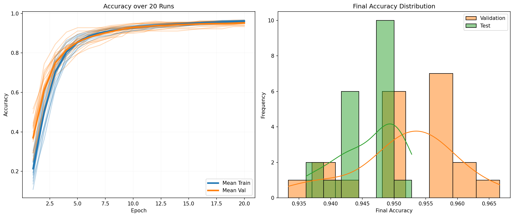
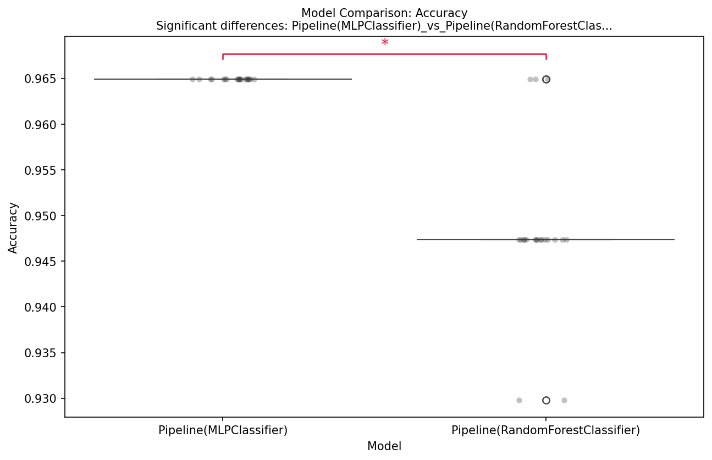
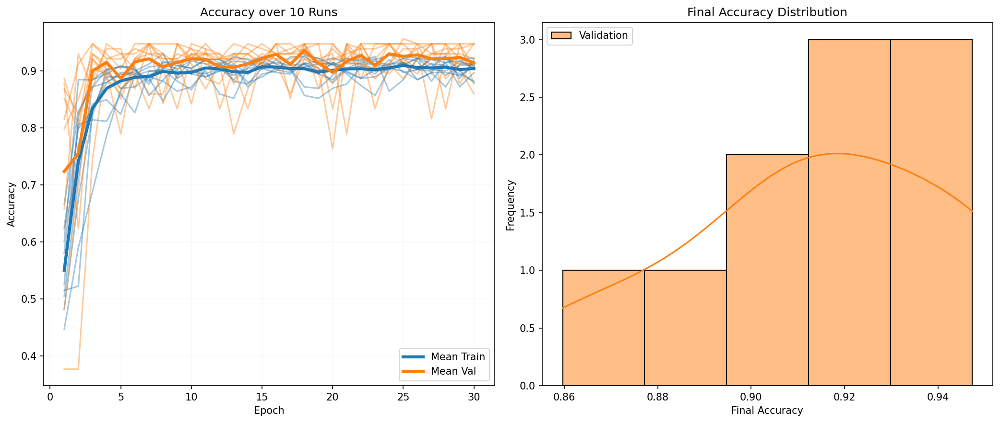

# Ictonyx

A Python framework for evaluating machine learning training variability and performing rigorous statistical comparisons.

[](https://github.com/skizlik/ictonyx/actions/workflows/test.yml)
[](https://pypi.org/project/ictonyx/)


[](https://colab.research.google.com/github/skizlik/ictonyx/blob/main/examples/quickstart.ipynb)

---

## The problem

Training a machine learning model involves stochastic factors: random weight initialisation, data shuffling, dropout. Train the same architecture on the same dataset twice and you will get different weights, different predictions, and different evaluation metrics.

This means a model's performance metrics are random variables, not constants — and treating them as constants, as is often done in practice, undermines the robustness and validity of our conclusions. Reporting accuracy from a single training run is not an adequate assessment; it is a sample of size one.

Ictonyx trains a model N times under independent random seeds, collects the full distribution of outcomes, and provides the statistical machinery to reason about that distribution rigorously.

---

## Installation
```bash
pip install ictonyx
```

### Optional extras

| Extra | What it includes | Install |
|---|---|---|
| `sklearn` | scikit-learn, joblib | `pip install ictonyx[sklearn]` |
| `tensorflow` | TensorFlow, Keras | `pip install ictonyx[tensorflow]` |
| `torch` | PyTorch | `pip install ictonyx[torch]` |
| `huggingface` | Transformers, datasets, accelerate | `pip install ictonyx[huggingface]` |
| `mlflow` | MLflow tracking | `pip install ictonyx[mlflow]` |
| `explain` | SHAP explainability | `pip install ictonyx[explain]` |
| `tuning` | Optuna hyperparameter tuning | `pip install ictonyx[tuning]` |
| `isolation` | Process isolation for GPU runs | `pip install ictonyx[isolation]` |
| `progress` | tqdm progress bars | `pip install ictonyx[progress]` |
| `all` | Everything above | `pip install ictonyx[all]` |

Extras can be combined:
```bash
pip install "ictonyx[tensorflow,isolation]"
```

Requires Python 3.10+. Current release: **0.4.11** — [changelog](CHANGELOG.md) · [PyPI](https://pypi.org/project/ictonyx/)

---

### Documentation

[Ictonyx documentation](https://ictonyx.readthedocs.io/en/latest/) is hosted on Read the Docs.

### Docker environment

A GPU-enabled container with TensorFlow, PyTorch, and the HuggingFace
stack pre-installed. Files created inside the container are owned by
your host user, not root.  Requires Docker.

```bash
./build-gpu.sh           # build the image
./test-gpu.sh            # verify the Docker build
./run-gpu.sh             # launch Jupyter on port 8888
./run-gpu.sh bash        # interactive shell
```

The NVIDIA Container Toolkit is required for GPU acceleration.
CPU-only for macOS and non-NVIDIA systems.

---


## What does Ictonyx measure?

Ictonyx characterizes **training-derived randomness** under a fixed data split. Metrics are assessed across different seeds — isolating the random effects in initialization, batch order, augmentation, and dropout — while holding the train/val/test split constant. Repeated runs of the same model on the same data allow for a variety of plotting and analysis functions.

Ictonyx does **not** currently measure **sampling variability** — which is caused by the random nature of a train-validation-test split. Different splits produce different results.  At present, this can be addressed by using Ictonyx within an outer k-fold loop. In a later release, Ictonyx will ship ResamplingPolicy for nested (data × seed) designs with corrected comparison tests (Nadeau-Bengio, Bouckaert, Dietterich 5×2).

---

## Quick start

Train a small feed-forward network on the wine data from sklearn twenty times and observe the distribution of outcomes.  Here, we'll use a simple Tensorflow model.

```python
import tensorflow as tf
from sklearn.datasets import load_wine
import ictonyx as ix

data = load_wine()
X, y = data.data, data.target
# Ictonyx splits X into train/val/test itself, so do not fit a scaler on the
# full array here: validation and test statistics would leak into training.
# Scale inside the model instead (BatchNormalization on the inputs), or use
# an sklearn Pipeline as in the comparison example below.


def build_model(config):
    model = tf.keras.Sequential([
        # momentum=0.9: in ~80 training steps the default (0.99) leaves the
        # moving statistics near their initial values, so the model would see
        # effectively unscaled features at evaluation time.
        tf.keras.layers.BatchNormalization(momentum=0.9),
        tf.keras.layers.Dense(16, activation='relu'),
        tf.keras.layers.Dense(16, activation='relu'),
        tf.keras.layers.Dense(3, activation='softmax')
    ])
    model.compile(optimizer='adam',
                  loss='sparse_categorical_crossentropy',
                  metrics=['accuracy'])
    return ix.KerasModelWrapper(model)

results = ix.variability_study(
    model=build_model,
    data=(X, y),
    runs=20,
    epochs=20,
    seed=42,
    verbose=False
)

print(results.summarize())
```

```
Variability Study Results
==============================
Successful runs: 20
Seed: 42
Data split: train 124 / val 18 / test 36
Stratified split: yes
Evaluation-set sampling error: +/-5.2 pp (binomial SE of test_accuracy = 0.892 at n_eval = 36). Seed variation cannot reduce this, and no seed-level test includes it.

Test Set Metrics:
--------------------
accuracy:
  N:                20
  Mean:             0.8917
  SD (sample, N-1): 0.0422
  SE:               0.0094
  Min:              0.8333
  Max:              0.9722
loss:
  N:                20
  Mean:             0.4901
  SD (sample, N-1): 0.1016
  SE:               0.0227
  Min:              0.3229
  Max:              0.7102

Training & Validation Metrics:
--------------------
train_accuracy:
  N:                20
  Mean:             0.9069
  SD (sample, N-1): 0.0303
  SE:               0.0068
  Min:              0.8629
  Max:              0.9597
train_loss:
  N:                20
  Mean:             0.5038
  SD (sample, N-1): 0.0940
  SE:               0.0210
  Min:              0.3792
  Max:              0.7088
val_accuracy:
  N:                20
  Mean:             0.9139
  SD (sample, N-1): 0.0732
  SE:               0.0164
  Min:              0.7778
  Max:              1.0000
val_loss:
  N:                20
  Mean:             0.5041
  SD (sample, N-1): 0.1083
  SE:               0.0242
  Min:              0.3387
  Max:              0.7007
```

On a 178-sample dataset, the same architecture produces models with validation accuracy ranging from 78% to 100% depending solely on the random seed. The validation set has 18 examples, so one example is 5.6 percentage points. Averaging over runs resolves finer than that, but every run is scored on the same small evaluation sets, and their sampling error (the ±5.2 pp that `summarize()` reports for test accuracy on 36 examples) is shared by every run: no number of runs reduces it. Classification splits are stratified by default, so each split keeps the class proportions of the whole dataset.  Ictonyx also provides for plotting of training histories:

```python
ix.plot_variability_summary(results=results, metric='accuracy')
```



---

## Comparing two models

Because of training variability, a single run is generally inadequate to make valid comparisons between models with respect to a particular metric.  Ictonyx facilitates more statistically sound model comparison with its compare_models() function, which runs multiple models the same number of times, and applies an appropriate hypothesis test to the results.

Ictonyx also supports sklearn estimators — pass a class or a configured instance directly; no wrapper is required. Every `random_state` in an instance, including inside Pipelines and meta-estimators, is overridden with the per-run seed (a warning says so once).

```python
import ictonyx as ix
from sklearn.datasets import load_breast_cancer
from sklearn.ensemble import RandomForestClassifier
from sklearn.neural_network import MLPClassifier
from sklearn.pipeline import make_pipeline
from sklearn.preprocessing import StandardScaler

# Wine's 18-example validation set cannot separate two strong models: on it,
# both score 100% on every run. The breast-cancer data is larger.
X_bc, y_bc = load_breast_cancer(return_X_y=True)

# A Pipeline fits the scaler on each run's training data only. Ictonyx seeds
# every random_state in the pipeline per run and names it by its final estimator.
comparison = ix.compare_models(
    models=[
        make_pipeline(StandardScaler(), MLPClassifier(hidden_layer_sizes=(64,), max_iter=200)),
        make_pipeline(StandardScaler(), RandomForestClassifier(n_estimators=40)),
    ],
    data=(X_bc, y_bc),
    runs=20,
    metric='val_accuracy',
    seed=42,
    verbose=False,
)

print(comparison.get_summary())

ix.plot_comparison_boxplots(comparison)
```

```
Model Comparison Results (val_accuracy)
========================================
Models compared: 2
Test: Paired Wilcoxon Signed-Rank Test: 0.000, p=0.0001 ***, matched-pairs rank-biserial r=0.971, 95% CI [0.0123, 0.0202]

Pairwise comparisons (none correction):
  Pipeline(MLPClassifier)_vs_Pipeline(RandomForestClassifier): Paired Wilcoxon Signed-Rank Test: 0.000, p=0.0001 ***, matched-pairs rank-biserial r=0.971, 95% CI [0.0123, 0.0202] *

Significant pairs: Pipeline(MLPClassifier)_vs_Pipeline(RandomForestClassifier)
```



Each model receives the same seed per run: each MLP run is directly paired with the corresponding Random Forest run.  This allows us to use the non-parametric paired Wilcoxon signed-rank test.

Here the MLP classified 55 of the 57 validation examples correctly (96.5%) on every run, while the random forest ranged from 53 to 55 (93.0% to 96.5%). The MLP was never worse, so the paired test is decisive (p=0.0001; matched-pairs rank-biserial r=0.971; 95% CI for the mean paired difference 1.2 to 2.0 percentage points). That difference is about one validation example, smaller than the evaluation set's own sampling error at this accuracy (about ±2.4 pp). What a significant paired result establishes is that, **on this train/validation split**, MLP's seed-to-seed distribution is shifted relative to Random Forest's. It does not by itself establish that MLP is the more accurate model on new splits or new data; the sampling error of the fixed evaluation set is shared by every run and is not part of the test. Pairing on seed guarantees aligned samples; it does not make the test more powerful than an unpaired one, so plan `runs` accordingly.

The 'none correction' label is present because with only two models, no multiple-comparison correction is applied.

---

## Process isolation for GPU runs

Keras models accumulate GPU memory across training runs. For studies with many runs or large models, use_process_isolation allows each training session to be run in an isolated subprocess:

```python
results = ix.variability_study(
    model=build_model,
    data=(X, y),
    runs=20,
    epochs=20,
    use_process_isolation=True,
    gpu_memory_limit=4096,
    seed=42,
)
```

Each run executes in a child process and exits cleanly, releasing all GPU memory before the next run begins.

---

## PyTorch

Ictonyx also supports PyTorch models:

```python
import torch
import torch.nn as nn
import ictonyx as ix
from ictonyx import PyTorchModelWrapper, ArraysDataHandler, ModelConfig

def build_net(config: ModelConfig) -> PyTorchModelWrapper:
    model = nn.Sequential(
        nn.Linear(30, 64), nn.ReLU(),
        nn.Linear(64, 32), nn.ReLU(),
        nn.Linear(32, 2),
    )
    return PyTorchModelWrapper(
        model,
        criterion=nn.CrossEntropyLoss(),
        optimizer_class=torch.optim.Adam,
        optimizer_params={'lr': config.get('learning_rate', 0.001)},
        task='classification',
    )

# Pass arrays directly — Ictonyx handles splitting
import numpy as np
from sklearn.datasets import load_breast_cancer
data = load_breast_cancer()
X = data.data.astype(np.float32)
y = data.target.astype(np.int64)

results = ix.variability_study(
    model=build_net,
    data=ArraysDataHandler(X, y, val_split=0.2, test_split=0.1),
    runs=20,
    seed=42,
)

ix.plot_variability_summary(results=results, metric='accuracy')

```



---

## Working with results

```python
# Full distribution of any metric across runs
results.get_metric_values('val_accuracy')       # List[float]

# Per-epoch statistics across all runs
results.get_epoch_statistics('val_accuracy')    # DataFrame: epoch, mean, sd, se, ci_lower, ci_upper

# All per-run, per-epoch DataFrames
results.all_runs_metrics                        # List[pd.DataFrame]

# Seed for exact reproducibility
results.seed
```

---

## Examples

The `examples/` directory contains Jupyter notebooks:

- `quickstart.ipynb` — wine dataset variability study and three-model comparison using Keras and sklearn. No GPU required for the comparison sections.
- `01_mnist_variability_study.ipynb` — deep dive into Keras CNN variability on MNIST with full visualisation
- `02_mnist_model_comparison.ipynb` — comparing two CNN architectures statistically
- `03_learning_rate_variability.ipynb` — hyperparameter sweep across learning rates and batch sizes using `run_grid_study()`
- `04_pytorch_classification.ipynb` — PyTorch classification variability study with epoch-level diagnostics
- `05_pytorch_regression.ipynb` — PyTorch regression variability study with known ground truth
- `06_sklearn_models.ipynb` — sklearn classification and regression: single-model variability and multi-model comparison
- `07_run_independence.ipynb` — verifying the IID assumption: autocorrelation diagnostics on real and synthetic run sequences
- `08_sample_size.ipynb` — how many seeds you need: sequential CI narrowing, 1/√N scaling, and practical recommendations
- `09_huggingface_text_classification.ipynb` — HuggingFace transformer variability: fine-tuning variance, paired model comparison, and winner-reversal on real text data
---

## License

MIT. See [LICENSE](LICENSE).

---

## Citation

If you use Ictonyx in published work, please cite it using the metadata in [`CITATION.cff`](CITATION.cff), or use the **Cite this repository** button on the GitHub repository page.

```bibtex
@software{kizlik_ictonyx,
  author  = {Kizlik, Stephen},
  title   = {Ictonyx: A Framework for Variability Analysis in Machine Learning Training},
  version = {0.4.11},
  url     = {https://github.com/skizlik/ictonyx},
  license = {MIT},
}
```

**Iteration Comparison Testing Over N-runs: Yield eXamination**
